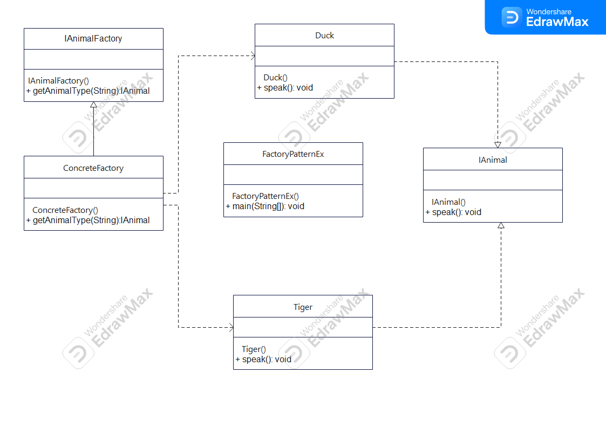

 Factory Method Pattern Demo
Description

This project demonstrates the Factory Method Design Pattern in Java.
The factory dynamically creates Duck and Tiger objects.
If an unsupported animal like Lion is requested, an exception is thrown.

 UML Diagram

  

